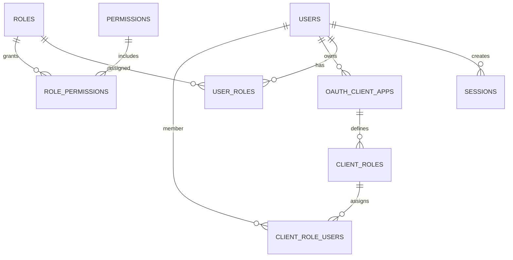

# PostgreSQL Migration Guide

This document describes the relational schema for replacing MongoDB with PostgreSQL and provides guidance for migrating existing data. Redis continues to handle session data, caching, and rate limiting.

## Entity Relationship Diagram

## Migration Overview

### Users
The `users` collection becomes the `users` table. Array fields like `providerRoles` are normalized into the `user_roles` join table. Unique constraints enforce a single record per username and email, and a composite index ensures that external identity provider IDs remain unique.

### OAuth Client Apps
Documents from `oauthClientApps` map to the `oauth_client_apps` table. The `owner` field links to `users.id`. Client roles associated with each app move into the `client_roles` table, with uniqueness enforced on the combination of client and role name.

### OAuth Roles
The `oauthRoles` collection is split into `client_roles` and the join table `client_role_users`. Each entry in `oauthUserIds` becomes a row in `client_role_users` linking a user to a role for a specific client application.

### Sessions
Session bodies remain in Redis for performance. The optional `sessions` table tracks metadata such as IP, user agent, and expiration to support auditing and management features.

## Migration Steps
1. **Export Data** from MongoDB using `mongoexport` or a similar tool for each collection (`users`, `oauthClientApps`, `oauthRoles`).
2. **Transform Arrays**: Convert `providerRoles` and `oauthUserIds` into row sets for `user_roles` and `client_role_users` respectively.
3. **Load Core Data**: Insert user, client application, and role records into their respective tables using `COPY` or batched inserts.
4. **Load Join Tables**: Populate `user_roles` and `client_role_users` with the transformed array data.
5. **Verify and Index**: Run the schema script, validate foreign keys, and ensure all indexes have been created before redirecting the application to PostgreSQL.

## Redis Integration
Redis continues to provide fast access to ephemeral data:
- **Sessions**: Actual session payloads stay in Redis, while PostgreSQL stores optional metadata.
- **Caching**: Frequently read data from PostgreSQL may be cached in Redis for performance.
- **Rate Limiting & Queues**: Existing Redis-based mechanisms remain unchanged.

